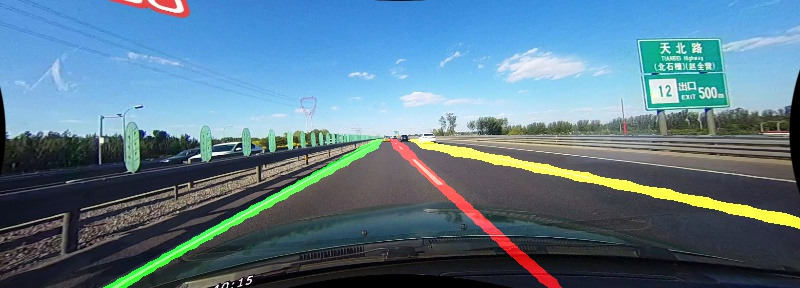

# SCNN lane detection in Pytorch

SCNN is a segmentation-tasked lane detection algorithm, described in ['Spatial As Deep: Spatial CNN for Traffic Scene Understanding'](https://arxiv.org/abs/1712.06080). The [official implementation](<https://github.com/XingangPan/SCNN>) is in lua torch.

This repository contains a re-implementation in Pytorch.


## Data preparation

### CULane

The dataset is available in [CULane](https://xingangpan.github.io/projects/CULane.html). Please download and unzip the files in one folder, which later is represented as `CULane_path`. 
```
CULane_path
├── driver_100_30frame
├── driver_161_90frame
├── driver_182_30frame
├── driver_193_90frame
├── driver_23_30frame
├── driver_37_30frame
├── laneseg_label_w16
├── laneseg_label_w16_test
└── list
```

Then modify the path of `CULane_path` in `config.py`. **Note: absolute path is encouraged.**


### Tusimple
The dataset is available in [here](https://github.com/TuSimple/tusimple-benchmark/issues/3). Please download and unzip the files in one folder, which later is represented as `Tusimple_path`.
```
Tusimple_path
├── clips
├── label_data_0313.json
├── label_data_0531.json
├── label_data_0601.json
└── test_label.json
```

**Note:  seg\_label images and gt.txt, as in CULane dataset format,  will be generated the first time `Tusimple` object is instantiated. It may take time.**


## Demo Test

For single image demo test:

```
python demo_test.py -i demo/demo.jpg -w experiments/exp0/exp0_best.pth [--visualize / -v]
```

**An unevaluated trained model for CULane Dataset can be download [here](https://drive.google.com/file/d/1IlPJ7zxyiage5oKcHxojufoxxleq5JoH) .**




## Train 

1. Specify an experiment directory, e.g. `experiments/exp0`.  Assign the path to variable `exp_dir` in `train.py`.

2. Modify the hyperparameters in `experiments/exp0/cfg.json`.

3. Start training:

   ```python
   python train.py [--resume / -r]
   ```

4. Monitor on tensorboard:

   ```
   tensorboard --logdir='experiments/exp0' > experiments/exp0/board.log 2>&1 &
   ```

**Note**


- My model is trained with `torch.nn.DataParallel`. Modify it according to your hardware configuration.
- Currently the backbone is vgg16 from torchvision. Several modifications are done to the torchvision model according to paper, i.e., i). dilation of last three conv layer is changed to 2, ii). last two maxpooling layer is removed.


## Acknowledgement

This repos is build based on [official implementation](<https://github.com/XingangPan/SCNN>).

